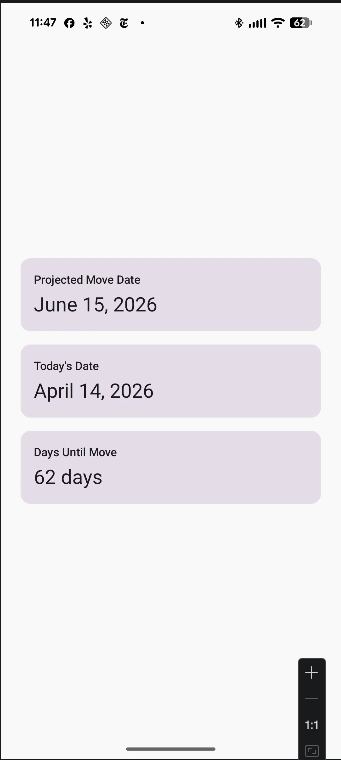

# Days Until Move

A simple Android app that counts down the days until your projected move date.

## Screenshot



## Features

- **Projected Move Date** — tap to pick a date; persists across app restarts
- **Today's Date** — always shows the current date
- **Days Until Move** — live countdown calculated from today to your move date

## How It Works

Tap the **Projected Move Date** card to open a date picker. Once set, the app
calculates and displays the number of days remaining. The chosen date is saved
in SharedPreferences so it survives closing and reopening the app.

## Tech Stack

- Kotlin
- Jetpack Compose (Material 3)
- Android SharedPreferences for persistence
- `minSdk 24` — runs on Android 7.0 and above

## Build & Run

```shell
# Windows
.\gradlew.bat :composeApp:assembleDebug

# macOS / Linux
./gradlew :composeApp:assembleDebug
```

## Adding the Screenshot

1. Run the app on a device or emulator.
2. Capture the screen, then save the image to `screenshots/app_screenshot.png`.

   Quick capture via adb:
   ```shell
   mkdir screenshots
   adb exec-out screencap -p > screenshots/app_screenshot.png
   ```